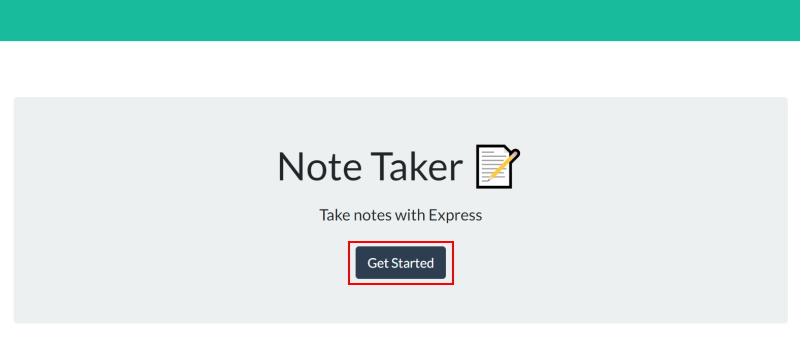

# note-taker

# Note Taker

## Description

The note taker application is a front end application that allows someone to easily add notes to their to-do list; the notes can be day-to-day tasks or, reminders of phone calls they need to make. My inspiration was myself! I'm constantly forgetting to jot notes downs, but now that it's on my computer it makes the process so much easier. 

I learnt alot about express, as this application was my first time installing and using it throughout building an entire back end system. I enjoyed creating the routes and being able to test the GET, POST and DELETE aspects through Insomnia. Further learing how to separate the file structure of a back/front end application has been a great learning process as the cleaner the code the happier I am with it.

---

## Table of Contents

- [Installation](#installation)
- [Usage](#usage)
- [Features](#features)
- [License](#license)
- [Credits](#credits)

---

## Installation

The user will need to clone the application from my GitHub account: https://github.com/RosemaryJF/note-taker, to their local repository, and have Node.js, npm  and Heroku installed on their code editor, if it isn't already.

Once cloned to the local repository the user will need to run `npm i` so that the necessary packages are installed on the application.

From there the user will be able to test launch the application from their intergrated terminal with the following command: `node server.js`. They can either test the application through localhost on their browser, or test the request through a program such as Insomnia.

From here they then run `heroku create` in their terminal; this will deploy the application to Heroku and allow them to use it from a live server there.

Alternatively, you can visit the Heroku deployed link below to bookmark and start using the Note Taker app:

---

## Usage

The image is what the Note Taker homepage looks like. The user simple clicks on the `Get Started` button to progress to the note taking screen. Once they do this they will be met with page similar to the image below.

To add a note they simply click the `+` icon, and enter the note title in the `Title` area, and what needs to be done, noted in the `Text` area. 

Once the user starts typing a new note a `save` icon appears next to the plus. This is pressed once the note is finished and will render the note in the column on the LHS of their screen. To view the notes again the user simply needs to click on the one they want to review. If needed the user can click the `bin` icon to delete a note.

The notes entered are saved in a JSON file and will persist for the user if they close the application and revisit later or on a different browser. 

---

## Features

The best feature of the whole application is the delete functionality, which allows the user to remove a note if they want to. This is represented by the reddish/pink bin icon in line with the saved notes. 

---

## License

This application is licensed under an [MIT license](https://github.com/RosemaryJF/team-profile-generator/blob/main/dist/LICENSE).

---

## Credits

* https://sydney.bootcampcontent.com/university-of-sydney/USYD-VIRT-FSF-PT-07-2022-U-LOLC/-/tree/main/11-Express/01-Activities/22-Stu_Modular-Routing

* https://www.thecodingwalrus.com/js/javascript-for-loop-alternatives-2/

* https://developer.mozilla.org/en-US/docs/Web/JavaScript/Reference/Global_Objects/Array/filter

* https://expressjs.com/en/starter/basic-routing.html

* https://www.tabnine.com/code/javascript/functions/express/Express/delete

* https://www.geeksforgeeks.org/express-js-app-delete-function/

* https://nodejs.org/api/fs.html#filehandlewritefiledata-options

* https://stackoverflow.com/questions/51400231/api-delete-method-in-express-js-error